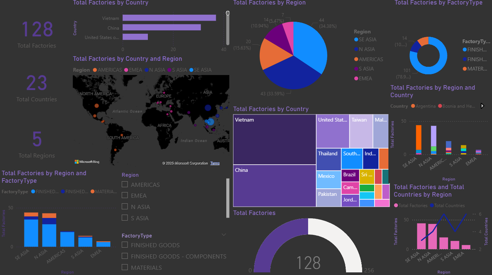

# 🏭 Nike Global Manufacturing BI Dashboard

This project analyzes Nike’s global manufacturing data using **Power BI**, SQL, and CSV data sources.  
It provides insights into factories, countries, regions, and factory types with interactive visualizations.

---

## 📊 Features

- **KPIs** → Total Factories, Countries, Regions
- **Charts** → Bar, Pie, Donut, Treemap, Gauge, Line & Column
- **Maps** → Filled Map for geographical insights
- **Filters (Slicers)** → Region & FactoryType filters

---

## 📂 Project Structure

NIKE-GLOBAL-MANUFACTURING-BI/
│── dashboard/
│ ├── dashboard.png # Dashboard Screenshot
│ └── nike_global_dashboard.pbix # Power BI File
│
│── data/
│ ├── raw/ # Raw input data
│ │ └── nikeManufacturing.csv
│ ├── lookup/ # Mapping tables
│ │ └── country_region_map.csv
│ └── processed/ # Cleaned data
│
│── docs/
│ ├── data_dictionary.md
│ ├── erd.png
│ ├── project_plan.md
│ └── sources.md
│
│── sql/
│ ├── mysql/
│ │ ├── 01_create_database.sql
│ │ ├── 02_create_tables.sql
│ │ ├── 03_load_raw_data.sql
│ │ └── 04_clean_transform.sql
│ └── utils/
│ └── constraints_indexes.sql
│
│── .gitignore
│── README.md

---

## 📸 Dashboard Preview




---

## ⚙️ Setup

1. Clone this repository
   ```bash
   git clone https://github.com/ShivamShashank11/nike-global-manufacturing-bi
   Open Power BI Desktop and load dashboard/nike_global_dashboard.pbix
   ```

Explore the interactive dashboard

📌 Tech Stack
Power BI (Visualization)

SQL (MySQL) (ETL + Transformations)

CSV/Excel (Raw + Lookup Data)

Markdown + GitHub (Docs & Collaboration)

👨‍💻 Author
Shivam Shashank

📧 Email: shivamshashank961@gmail.com

🌍 Location: Patna, Bihar

🔗 LinkedIn: www.linkedin.com/in/shivam-shashank-616957213
